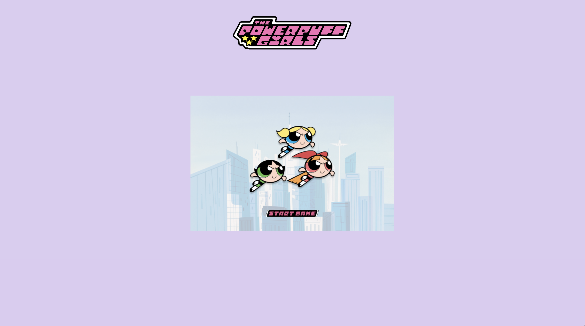
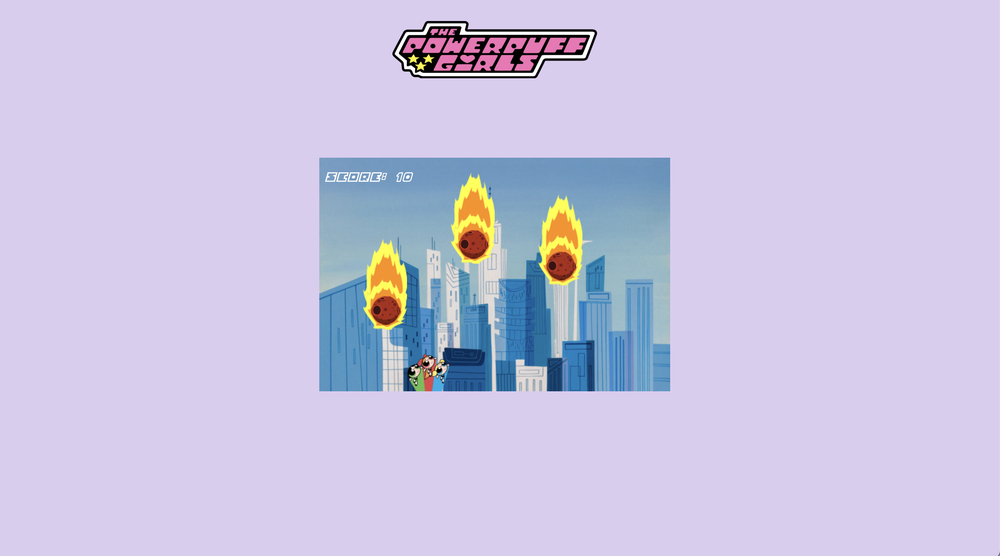
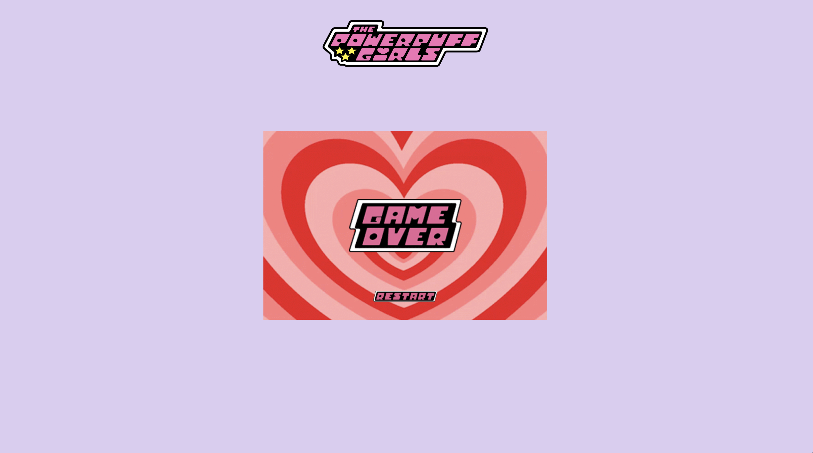

# Powerpuff Girls Game

# Introduction

This project was inspired by one of my favorite childhood shows, Powerpuff girls. The purpose of this game is to use the keyboard and dodge the meteors. Once touched by the meteors, it is game over.

To play the game click on this link: https://priceless-meitner-900d53.netlify.app/

# Project

## Coding Languages

The Powerpuff Girls game uses HTML, CSS and Javascript

## Game

The whole game is branded to the Powerpuff Girls theme show.

### 1. Start of the Game

The start page includes a start button, allowing it to begin.

### 2. Game In Session

During the game, you can use your keyboard to move the characters left and right in order to dodge the meteors falling. At the top left corner, there is a point tracker, that tracks every meteors that falls and adds a point to the game.

### 3. Game Over

Once the game is over, there is a restart button to enter back into a newly refreshed game.

